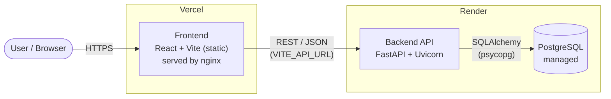
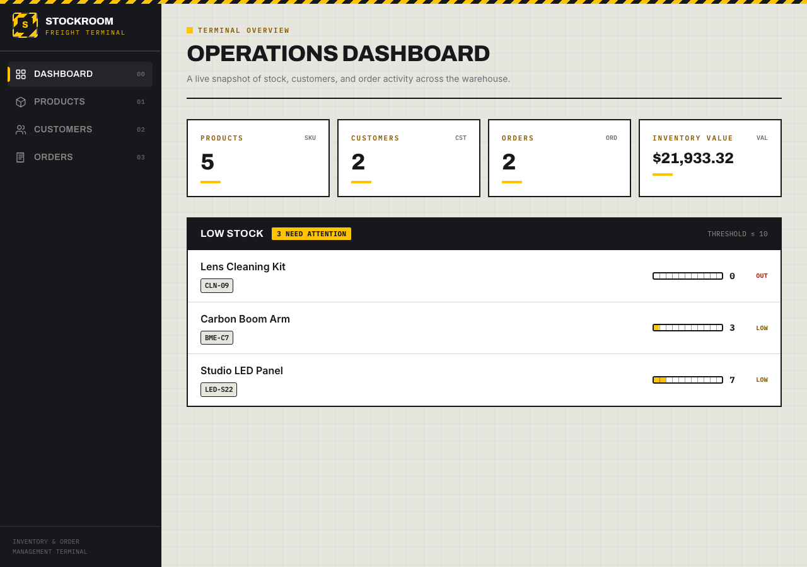
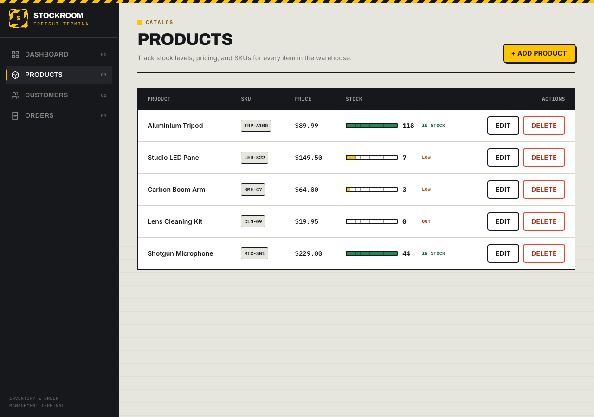
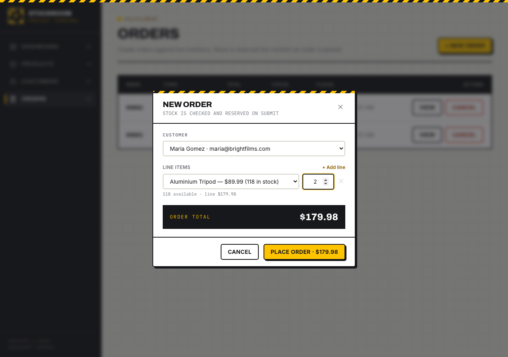
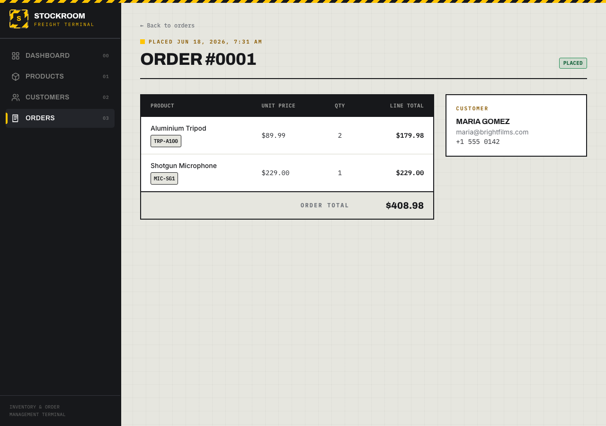

# Stockroom — Inventory & Order Management System

A production-grade, fully containerized full-stack application for managing
**products, customers, orders, and inventory tracking**. React frontend, FastAPI
backend, PostgreSQL database, orchestrated with Docker Compose and deployed to
free hosting.

## 🔗 Live demo & artifacts

| Resource | Link |
|---|---|
| 🖥️ **Frontend (Vercel)** | https://ethara-inventory-lyart.vercel.app |
| ⚙️ **Backend API (Render)** | https://inventory-api-lyf9.onrender.com |
| 📚 **API docs (Swagger)** | https://inventory-api-lyf9.onrender.com/docs |
| 🐳 **Docker Hub image** | https://hub.docker.com/r/adityachaudhari901/inventory-api |
| 💻 **Source (GitHub)** | https://github.com/AdityaChaudhari901/Ethara.Ai---Inventory-Order-Management-System- |

> The backend runs on Render's free tier, which sleeps after ~15 min idle. The
> first request after a nap takes ~30–50s to wake — just wait and refresh.

## Tech stack

| Layer | Technology |
|---|---|
| Frontend | React 18 (Vite), Tailwind CSS, React Router, Axios |
| Backend | Python 3.12, FastAPI, SQLAlchemy 2, Alembic, Pydantic v2, Uvicorn |
| Database | PostgreSQL 16 (local) / 18 (Render managed) |
| Infra | Docker (multi-stage, slim images), Docker Compose, nginx |
| Hosting | Vercel (frontend), Render (backend + managed Postgres) |

---

## Architecture



Locally the same three pieces run as Docker Compose services, with nginx
proxying `/api` to the backend. See **[docs/ARCHITECTURE.md](docs/ARCHITECTURE.md)**
for container, data-model (ER), order-flow sequence, and deployment diagrams.

---

## Screenshots

| Dashboard | Products |
|---|---|
|  |  |

| Create order (live total) | Order detail |
|---|---|
|  |  |

The UI follows a deliberate **"Freight Terminal"** design language — industrial
signage typography (Archivo), a **hazard-stripe** signature motif, flat
hard-edged panels, freight-label SKU chips, and a mechanical **ticked stock
gauge** that color-codes inventory health (green = in stock, amber = low,
red = out). Type pairing: Archivo (display) + Inter (body) + IBM Plex Mono
(data). Fully responsive desktop → mobile.

---

## Features

- **Products** — full CRUD, unique SKU, price + live stock level with status meter.
- **Customers** — add / list / delete, unique email.
- **Orders** — multi-line orders with a live-calculated total; cancelling an
  order returns stock.
- **Dashboard** — totals for products / customers / orders, inventory value, and
  a low-stock watchlist.
- **Responsive UI**, client-side validation, success/error toasts, empty &
  error states.
- **Swagger / OpenAPI** docs auto-generated at `/docs`.

---

## Business rules (enforced in backend + database)

- Product **SKU is unique**; customer **email is unique** (DB constraint → `409`).
- Product quantity **cannot go negative** (DB `CHECK` + request validation).
- Orders are **rejected when stock is insufficient** (`409` with a clear message).
- Placing an order **reduces stock atomically** in a single transaction, with
  `SELECT … FOR UPDATE` row locking to prevent overselling under concurrency.
- **Total amount is computed by the backend** from current prices — never
  trusted from the client.
- Cancelling/deleting an order **restores** its quantities to stock.
- Every endpoint validates input and returns appropriate HTTP status codes.

---

## Quick start (Docker Compose)

Requires Docker + Docker Compose.

```bash
git clone https://github.com/AdityaChaudhari901/Ethara.Ai---Inventory-Order-Management-System-.git
cd Ethara.Ai---Inventory-Order-Management-System-
cp .env.example .env        # adjust POSTGRES_PASSWORD etc.
docker compose up --build
```

- Frontend → http://localhost:3000
- Backend API → http://localhost:8000
- Swagger docs → http://localhost:8000/docs

The backend waits for Postgres to be healthy, runs Alembic migrations
automatically, then serves the API. Data persists in the named volume `pgdata`.

> If you change `POSTGRES_PASSWORD` after the first run, recreate the volume so
> Postgres re-initializes it: `docker compose down -v && docker compose up --build`.

---

## Local development (without Docker)

**Backend**

```bash
cd backend
python -m venv .venv && . .venv/bin/activate
pip install -r requirements.txt
export DATABASE_URL="sqlite:///./dev.db"   # zero-setup local DB
alembic upgrade head
uvicorn app.main:app --reload --port 8000
```

**Frontend**

```bash
cd frontend
npm install
npm run dev      # http://localhost:5173, proxies /api -> localhost:8000
```

---

## Configuration (environment variables)

No credentials are hardcoded anywhere. The backend reads config through
`app/core/config.py`.

| Variable | Used by | Purpose |
|---|---|---|
| `DATABASE_URL` | backend | Full DB URL (Render/Railway provide this). If empty, built from the parts below. |
| `POSTGRES_USER` / `POSTGRES_PASSWORD` / `POSTGRES_DB` / `POSTGRES_HOST` / `POSTGRES_PORT` | backend, db | Connection parts; safely URL-escaped (passwords may contain `@ : /`). |
| `CORS_ORIGINS` | backend | Allowed origins (comma-separated) or `*`. |
| `LOW_STOCK_THRESHOLD` | backend | Dashboard low-stock cutoff (default 10). |
| `VITE_API_URL` | frontend | Backend base URL baked in at build time. |

See `.env.example`, `backend/.env.example`, and `frontend/.env.example`.

---

## API reference

Interactive docs at `/docs`. Full reference with examples in
**[docs/API.md](docs/API.md)**. Summary:

| Method | Path | Purpose |
|---|---|---|
| `GET/POST` | `/products` | List / create products |
| `GET/PUT/DELETE` | `/products/{id}` | Read / update / delete a product |
| `GET/POST` | `/customers` | List / create customers |
| `GET/DELETE` | `/customers/{id}` | Read / delete a customer |
| `GET/POST` | `/orders` | List / create orders |
| `GET/DELETE` | `/orders/{id}` | Read / cancel an order (restores stock) |
| `GET` | `/dashboard/summary` | Totals + low-stock list |
| `GET` | `/health` | Health check |

---

## Project structure

```
.
├── backend/                 FastAPI application
│   ├── app/
│   │   ├── core/config.py    env-driven settings + safe DB URL building
│   │   ├── db/               engine, session, declarative base
│   │   ├── models/           SQLAlchemy models (product, customer, order, order_item)
│   │   ├── schemas/          Pydantic request/response models
│   │   ├── crud/             data-access for products & customers
│   │   ├── services/orders.py order business logic (stock, totals, atomicity)
│   │   ├── routers/          API routes
│   │   └── main.py           app, CORS, router mounting, /health
│   ├── alembic/              database migrations
│   ├── tests/                pytest suite (business rules + API)
│   └── Dockerfile
├── frontend/                React + Vite + Tailwind SPA
│   ├── src/
│   │   ├── api/client.js      axios client + typed API helpers
│   │   ├── components/        Layout, Modal, Toast, ui primitives, StockMeter
│   │   ├── pages/             Dashboard, Products, Customers, Orders, OrderDetail
│   │   └── hooks/useFetch.js
│   ├── nginx.conf            serves the build, proxies /api to the backend
│   └── Dockerfile
├── docs/                    architecture, API reference, screenshots
├── docker-compose.yml       frontend + backend + db
├── render.yaml              backend + managed Postgres on Render
└── DEPLOYMENT.md            step-by-step cloud deployment guide
```

---

## Testing

```bash
cd backend && . .venv/bin/activate
pytest -q
```

20 tests run on in-memory SQLite (no PostgreSQL needed) and cover every business
rule above plus CRUD and validation paths.

> **Note:** SQLite is used **only** by the automated test suite for speed. The
> running application — local Docker, and the deployed Render instance — stores
> all product, customer, and order data in **PostgreSQL**.

---

## Deployment

See **[DEPLOYMENT.md](DEPLOYMENT.md)** for deploying the backend to Render, the
frontend to Vercel, and the backend image to Docker Hub, including the full
environment-variable matrix.

---

## Author

Aditya Chaudhari — built as a technical assessment.
