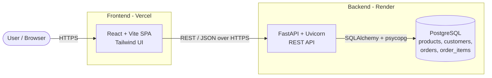
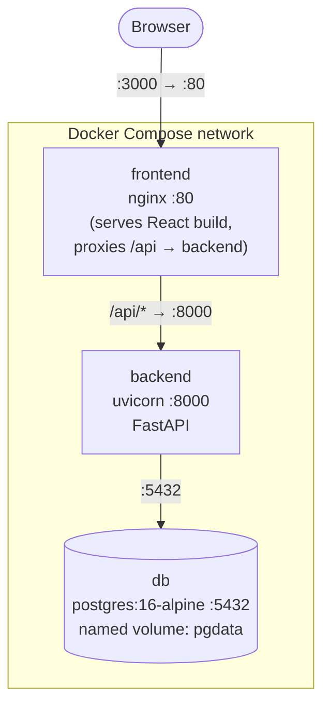
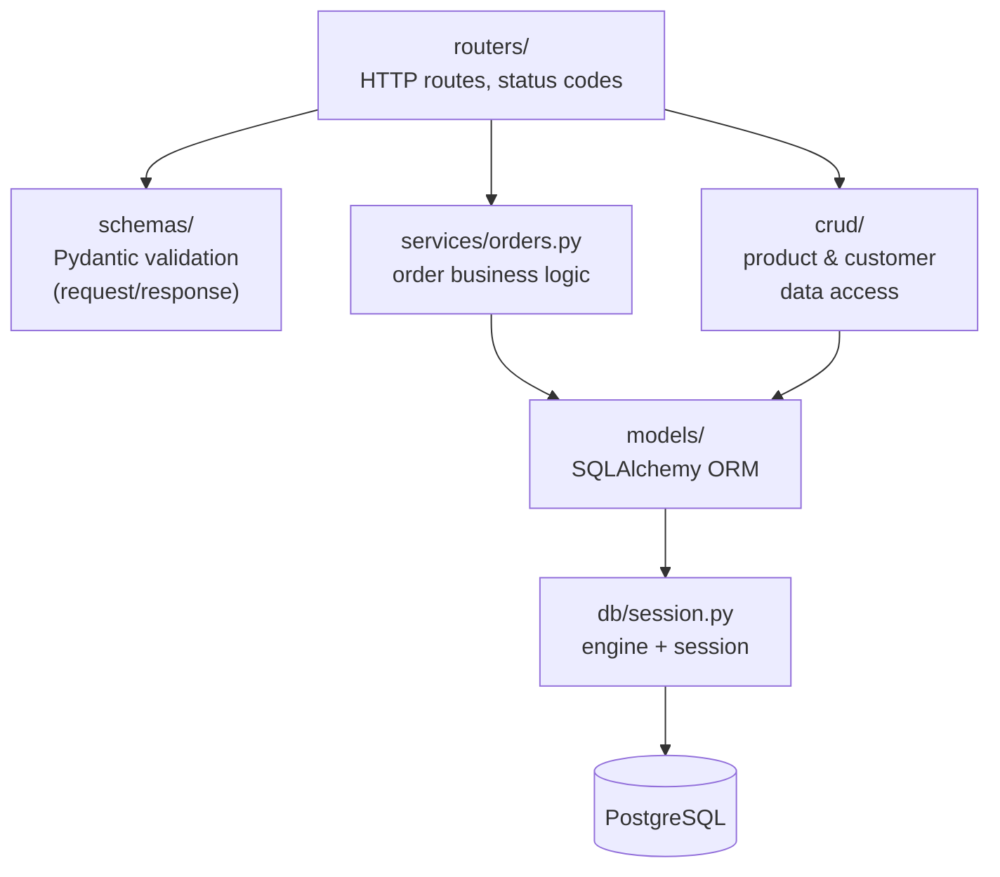
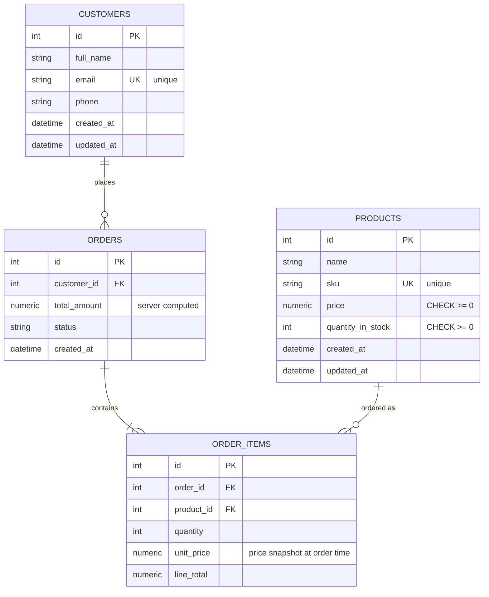
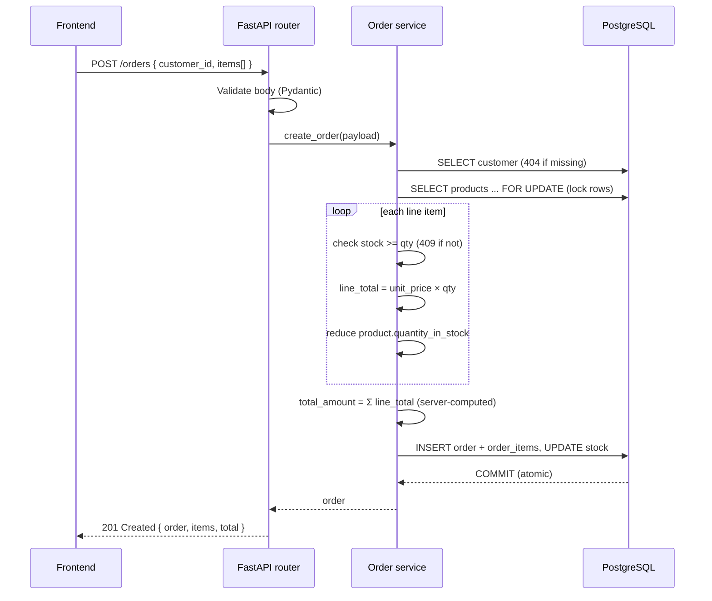
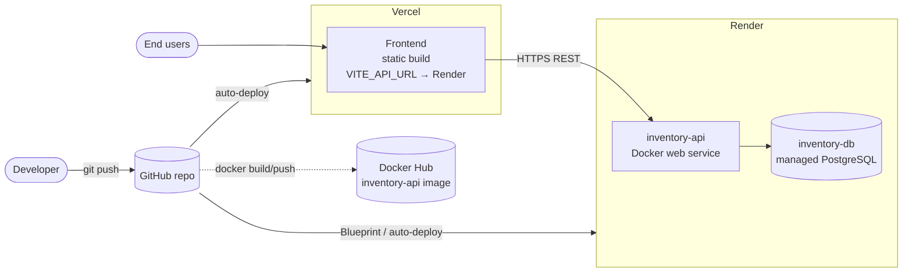

# Architecture

This document describes how the Inventory & Order Management System is put
together: its high-level structure, the data model, the order-placement flow,
and how it is deployed. All diagrams use [Mermaid](https://mermaid.js.org/), which
renders natively on GitHub.

---

## 1. System context

Three independent pieces communicate over HTTP/JSON and SQL.

Each piece can be developed, tested, and scaled independently. The frontend is a
static bundle; the backend is stateless (all state lives in Postgres).

---

## 2. Local container topology (Docker Compose)

Locally the same system runs as three Compose services on one network. nginx
serves the built frontend and reverse-proxies `/api` to the backend, so the
browser only ever talks to one origin.

Key infrastructure choices:

- **Multi-stage, slim images** — `python:3.12-slim` builder→runtime for the
  backend (non-root user), `node:20-alpine` build → `nginx:alpine` for the frontend.
- **Healthchecks** on all three services; the backend waits for the DB to be
  `healthy` before starting.
- **Named volume `pgdata`** persists database data across restarts.
- **No hardcoded credentials** — everything comes from `.env`.

---

## 3. Backend layering

The backend follows a clean layered structure so each unit has one job.

- **routers** translate HTTP ↔ Python, nothing more.
- **schemas** validate every incoming request and shape every response.
- **services/crud** hold the logic; routers stay thin.
- **models** define tables and constraints (the last line of defence for the
  business rules).

---

## 4. Data model (ER diagram)

Notes:

- An **order has many order_items**, supporting multiple products per order.
- `unit_price` is **snapshotted** onto each order item, so later price changes
  never alter historical order totals.
- Unique constraints on `products.sku` and `customers.email` enforce two of the
  core business rules at the database level.

---

## 5. Order placement flow (the critical path)

Creating an order is the most rule-heavy operation. It validates, checks stock,
reduces inventory, and computes the total — all in **one atomic transaction**.

If any check fails, the transaction rolls back and **no stock is changed**. The
`FOR UPDATE` lock means two concurrent orders for the same product cannot both
pass the stock check and oversell.

Deleting an order reverses this: each item's quantity is **added back** to its
product's stock before the order is removed.

---

## 6. Deployment topology

- **Frontend** deploys from `frontend/` on Vercel; `VITE_API_URL` points at the
  Render backend.
- **Backend** deploys via `render.yaml` (a Render Blueprint), which also
  provisions the managed PostgreSQL and injects `DATABASE_URL`.
- **CORS** on the backend is set to the Vercel origin so only the real frontend
  can call it.
- The **backend image** is also published to Docker Hub as a standalone,
  `linux/amd64` artifact.

---

## 7. Notable design decisions

| Decision | Why |
|---|---|
| Build DB URL from parts via `URL.create` | Passwords with `@ : /` (common on managed Postgres) break hand-built URL strings; `URL.create` escapes them safely. A full `DATABASE_URL` is still honored for platforms that provide one. |
| `unit_price` snapshot on `order_items` | Historical orders stay correct even if a product's price later changes. |
| `SELECT … FOR UPDATE` on order creation | Prevents two concurrent orders from overselling the same stock. |
| Server computes `total_amount` | The client can never tamper with pricing. |
| SQLite only in tests | Test suite runs in ~0.15s with zero setup; the real app always uses PostgreSQL. |
| Alembic migrations on container start | Schema is always in sync on deploy, no manual step. |
| Non-root container user, slim base images | Smaller attack surface and image size for production. |
